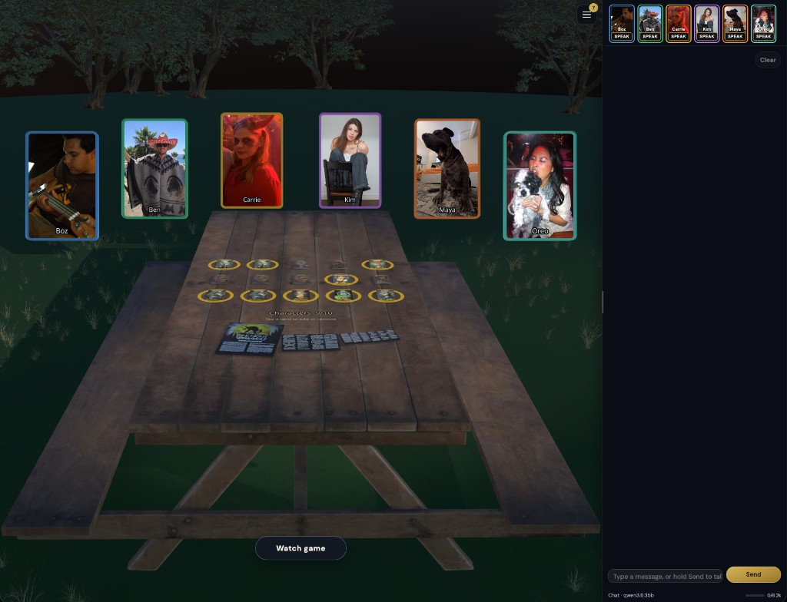

# One Night AI Werewolf

Play **One Night AI Werewolf** in the browser against AI opponents. One human at the table; configure LLM agents, pick a role deck, and run the night / day / vote loop entirely locally.

### [Play now →](https://higginsrob.github.io/one-night-ai-werewolf/)

No install. Open that link in a modern browser (Chrome, Safari, Firefox, Edge).



### Gameplay videos

Watch full games with different AI models as opponents:

| Model | Video |
|---|---|
| qwen3.5:35b | [Watch](https://www.youtube.com/watch?v=NPqEBLroTBY) |
| gemma4:26b | [Watch](https://www.youtube.com/watch?v=H8z4V8W6O2k) |
| haiku-4-5 | [Watch](https://www.youtube.com/watch?v=DuxFotwFqKA) |
| gpt-nano | [Watch](https://www.youtube.com/watch?v=cavFjJ79qfU) |
| gemini3.5 | [Watch](https://www.youtube.com/watch?v=joPvHnHPcRw) |

---

## How to play

### 1. Open the lobby

The app boots into the **lobby** with your saved profile (or “Player”). Set your name, photo, and persona under **Settings → You**.

### 2. Seat AI players

Use **Settings → AI providers**, **AI model configs**, and **AI players** to wire up an LLM backend and seat opponents at the table. Each AI player has a single profile photo (stock default or custom). Use **Guided import** to interview a guide agent and fill name / title / persona from a pasted bio.

### 3. Configure the game

Menu → **Settings → You** for your profile (name, photo, persona); **Settings → Game** for cast size, night/day timers, and scene options. Speech: add **OmniVoice** (or OpenAI-compatible) under AI providers, create a model config, then pick it under **Settings → TTS**. Start the match from Game once the deck and seat count are valid.

### 4. Start the night

Pick the **role deck** on the table, then start the game. You see only your own role. Follow the night prompts; when day comes, discuss with the AI agents and vote.

### 5. Day and vote

Talk it out at the table or in chat, mark your guesses, then cast a vote.

### 6. Reveal

When votes are in, roles flip and the winner is announced. Rematch or download the day log for a post-mortem.

---

## Tips

| | |
|---|---|
| **AI** | Configure a provider (e.g. Ollama or an API key) under Settings → AI providers, set a model **Use for chat**, then seat agents under AI players. |
| **TTS** | Add OmniVoice / OpenAI-compatible under AI providers → model config → Settings → TTS selects the active speech config. |
| **Guide agent** | In AI model configs, **Use as guide agent** preselects the model for Guided import interviews. |
| **Cast** | Select player cards + 3 center: **Start game** when the deck matches you + AIs; **Watch game** when it matches AIs only (3+) — spectators get a narrated night-action replay and full card/token vision. |

---

## What you need

- A phone, tablet, or computer with a recent browser  
- An AI provider for the NPC agents and table talk (local Ollama or a cloud API)  
- Ideally a device that can play audio — narrator / AI speech via browser TTS or a local OmniVoice speech API  

---

## Local development

```bash
bun install
bun run dev
```

Dev server listens on `0.0.0.0`. Open `http://localhost:5173` (or your LAN host). Point Ollama / SGLang / OmniVoice providers at full base URLs such as `http://127.0.0.1:11434`, `http://127.0.0.1:30000/v1`, and `http://127.0.0.1:8880/v1`.

```bash
bun run build
bun run lint
```

### OmniVoice TTS (optional)

Local [k2-fsa/OmniVoice](https://github.com/k2-fsa/OmniVoice) wrapper under `omniVoice/`:

```bash
# Apple Silicon — native MPS
make omnivoice-native

# NVIDIA Spark / DGX — CUDA Docker
make omnivoice-docker

# Auto: Darwin → native; else docker
make omnivoice-up
```

Admin UI: http://127.0.0.1:8880/admin — see [omniVoice/README.md](omniVoice/README.md).

---

## Credits

Fan project inspired by **One Night Ultimate Werewolf** by [Bezier Games](https://beziergames.com/). Not affiliated with or endorsed by Bezier Games. Own the physical game if you love it — this is a solo digital table against AI opponents.
